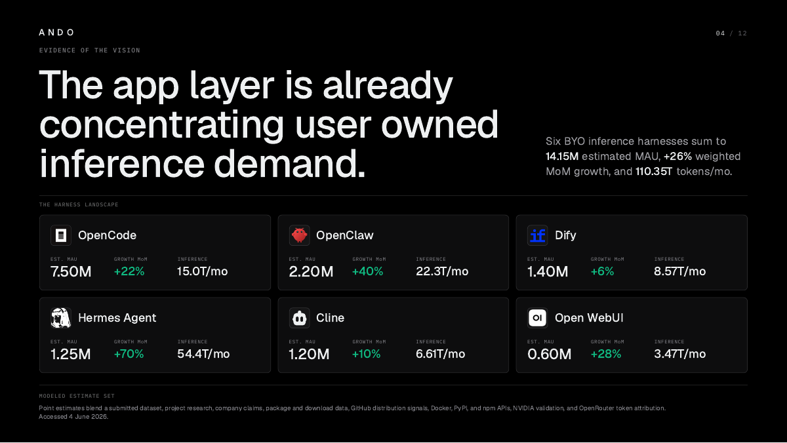

# Open Inference Layer

Open Inference Layer is a collection of open source products, tools, and protocols built to support decentralized AI.

Created by [Ando](https://andoai.xyz), an inference platform, Open Inference Layer is grounded in a simple belief: inference is the cornerstone of AI, and access to inference should be open, user-managed, and aligned with the people and applications that depend on it.

### Inference is how intelligence is made

### Ando Intro

### Apps Are Becoming Harnesses

### Evidence Of The Vision

